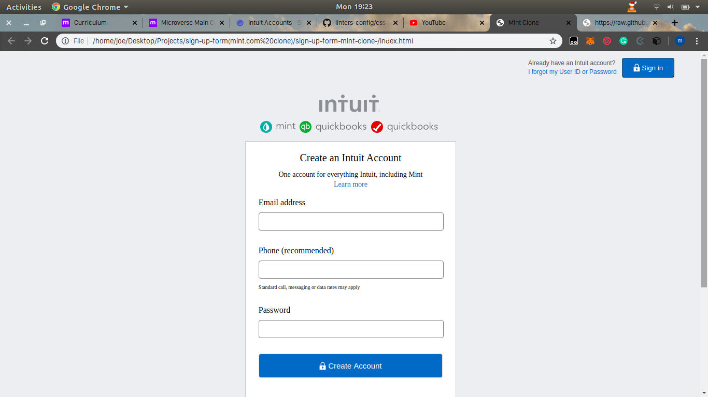

# sign-up-form-mint-clone-
> A clone of mint.com sign up form built using html and css only.

## Built with
- HTML
- CSS

## Getting Started
**Clone this project**
**Navigate to the project files and open index.html in your preferred browser**

### Prerequisites
- None 

### Setup
- None required

## Authors

👤 **Ibraheem Kabir**

- Github: [@ibraheemkabir](https://github.com/ibraheemkabir)

👤 **Joseph Mindo**

- Github: [@Mindo-Joseph](https://github.com/Mindo-Joseph)

## 🤝 Contributing

Contributions, issues and feature requests are welcome!

Feel free to check the [issues page](issues/).

## Show your support

Give a ⭐️ if you like this project!

## Acknowledgments

- Microverse for providing the project task

## 📝 License

This project is [MiT](lic.url) licensed.

